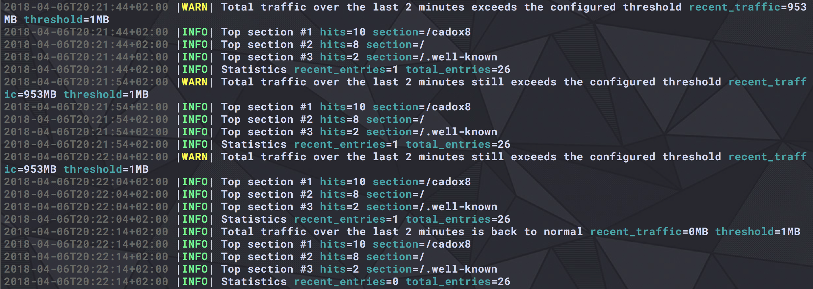

# HK Agent

A simple console program that monitors HTTP traffic on a machine.

<p align="center"></p>

<p align="center">Monitors all new HTTP logs</p>

<p align="center"></p>

<p align="center">Raises alerts when the traffic is too high</p>

## Instructions

### Dependencies

* `go`

#### Installing dep

* OSX: `brew install dep` and `brew upgrade dep`
* Others: Download the release package for your OS [here](https://github.com/golang/dep/releases)

### Steps to install

Make sure you installed the dependencies mentionned above.

1. `go get github.com/Ullaakut/hk-agent`
2. `cd $GOPATH/src/github.com/Ullaakut/hk-agent`
3. `dep ensure`
4. `go build -o hk-agent *.go`
5. `./hk-agent`

This will run the agent with the example log file provided in this repository. If you want to use your own log file, either change the value of the default log path in the configuration or wait for the [configuration feature](https://github.com/Ullaakut/hk-agent/issues/6) to be coded. Another solution is to create a symbolic link referencing your logs and called `logs` in this folder.

## Features

* [x] Consumes an actively written-to w3c-formatted HTTP access log (Common Log Format)
* [x] Every 10s, displays in the console the sections of the web site with the most hits as well as interesting summary statistics on the traffic as a whole.
* [x] Whenever the total traffic for the past 2 minutes exceeds a certain number on average, displays an alert
* [x] Whenever the total traffic drops again below that value on average for the past 2 minutes, displays a message saying that it recovered
* [x] All messages showing when alerting thresholds are crossed remain visible on the page for historical reasons

## Configuration

```go
type Config struct {
    // log level used by the logger
    LogLevel string

    // file path to the log file that will be read by hk-agent
    LogFilePath string

    // traffic threshold that triggers an alert when traffic from the last 2mns represents more
    // megabytes than this number
    TrafficThreshold uint64

    // number of top hits to display when processing metrics
    TopHitsNumber int

    // period after which the agent should fetch new logs and display new metrics/alerts
    RefreshPeriod time.Duration
}
```

## Testing

* `go test *.go -v`

## Potential future improvements

See the [issues](https://github.com/Ullaakut/hk-agent/issues?q=is%3Aopen+is%3Aissue+milestone%3A%22Potential+future+improvements%22) and [projects](https://github.com/Ullaakut/hk-agent/projects/2) pages for a list of possible improvements that could be done in the near future.

## Why did I use those libraries

* `rs/zerolog`: A monitoring tool should probably have structured logs
* `ullaakut/gonx`: (a fork of [satyrius/gonx](https://github.com/satyrius/gonx)) Because I didn't want to code a parser, and that this library seemed robust enough. Also, I had to fork it because in order to make my code more readable I wanted to be able to directly export a gonx.Entry into a JSON string, which was not possible from the outside.